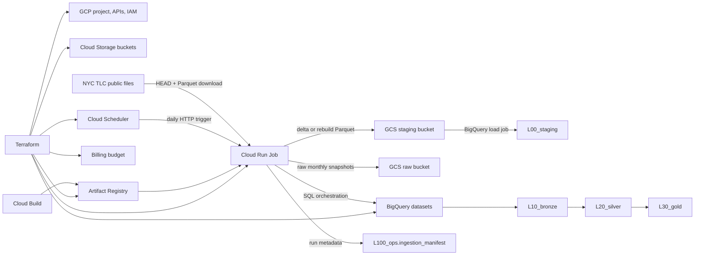
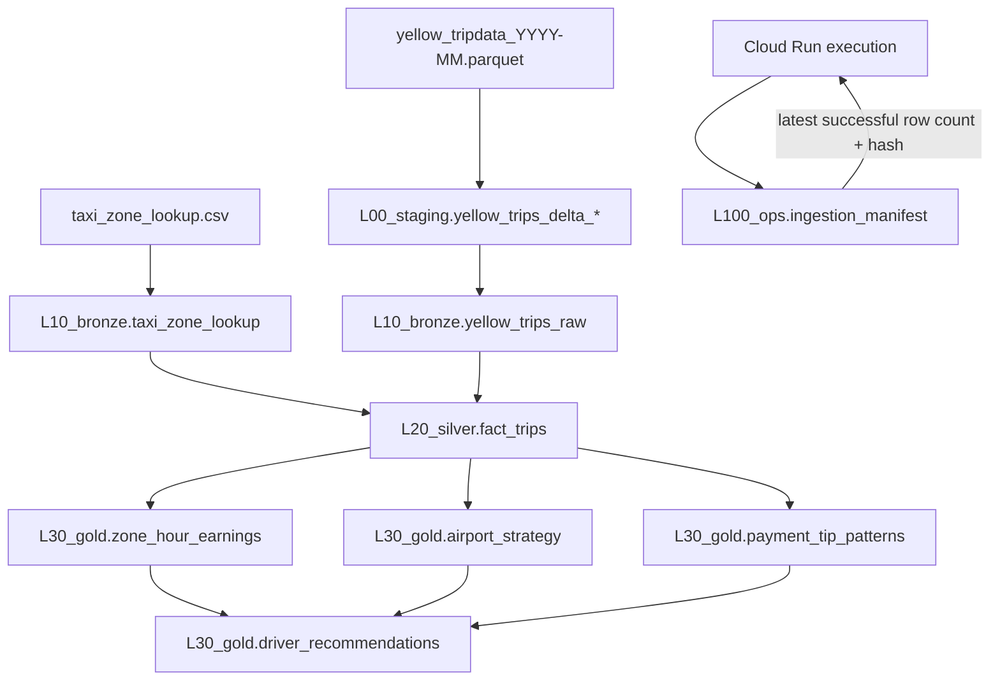

# NYC Taxi Driver Analytics - GCP Incremental Pipeline

Production-oriented GCP data engineering project for NYC yellow taxi analytics.

## Project objective

The objective of this project is to build a cost-efficient, reproducible analytics pipeline that helps identify profitable operating patterns for NYC yellow taxi drivers. The pipeline ingests mutable monthly trip files, preserves the raw records, cleans and enriches them with zone metadata, and produces BigQuery marts that support recommendations by zone, hour, airport activity, payment behavior and expected earnings.

The project is intentionally implemented as an end-to-end cloud data product rather than a notebook-only analysis. It includes infrastructure as code, containerized ingestion, incremental load handling, data quality flags, layered BigQuery transformations and operational scripts for scheduled runs and manual backfills.

The key engineering requirement is that the monthly Parquet file is mutable during the month: it receives new trip records over time. The pipeline is therefore scheduled daily, but the unit of work is the active monthly file.

## Data sources

The pipeline uses public datasets published by the New York City Taxi and Limousine Commission:

- [TLC Trip Record Data](https://www.nyc.gov/site/tlc/about/tlc-trip-record-data.page): monthly yellow taxi trip records in Parquet format. The runtime URL pattern is `https://d37ci6vzurychx.cloudfront.net/trip-data/yellow_tripdata_YYYY-MM.parquet`.
- [Taxi Zone Lookup](https://d37ci6vzurychx.cloudfront.net/misc/taxi_zone_lookup.csv): zone, borough and service-zone reference data used to enrich pickup and dropoff location IDs.

Data usage remains subject to the applicable [NYC Open Data Terms of Use](https://opendata.cityofnewyork.us/overview/). Raw source files are downloaded at runtime and are not committed to this repository.

## Project scope

This repository is designed to be deployable from a fresh clone with only local prerequisites and `infra/terraform.tfvars` configured.

Implemented capabilities:

- Pipeline code, ingest to clean to enrich: implemented in `app/ingest/taxi_ingest`, `sql/bronze`, `sql/silver` and `sql/gold`.
- Infrastructure as code: Terraform in `infra` creates the GCP project, APIs, buckets, BigQuery datasets, Artifact Registry, Cloud Run Job, Cloud Scheduler and IAM.
- Operational scripts: `scripts/build_and_deploy.ps1` builds the container image; `scripts/run_backfill.ps1` launches manual backfills with Cloud Run execution overrides.
- Data quality handling: raw records are preserved in bronze; silver adds quality flags; gold marts filter to analysis-eligible trips.
- Cost-aware incremental strategy: no-op source checks, append-only delta loading and month-scoped rebuilds.

## Approach

The cheapest robust design is a BigQuery-first batch pipeline:

1. A Cloud Run Job checks the monthly source Parquet metadata.
2. If the file did not change, the run exits as a no-op.
3. If the file changed, the job downloads the monthly snapshot and compares it with the latest successful manifest.
4. If the previous rows are unchanged, only new appended rows are written as a delta Parquet file and loaded to BigQuery.
5. If the file shrank, was reordered, or previous rows changed, the pipeline rebuilds only that month.
6. Silver and gold tables are refreshed only for the affected month.

This avoids scanning or rewriting historical data while still handling non-append source changes safely.

## Architecture

### Service architecture



### Data model and transformation flow



## GCP services

- Cloud Storage: raw snapshots and generated delta/rebuild Parquet files.
- Cloud Run Jobs: daily idempotent ingestion and transformation runner.
- BigQuery: ordered datasets `L00_staging`, `L10_bronze`, `L20_silver`, `L30_gold` and `L100_ops`.
- Cloud Scheduler: daily trigger.
- Artifact Registry: container image storage.
- Cloud Billing Budget: optional guardrail.

## Repository layout

```text
app/ingest/          Cloud Run Job source code
infra/               Terraform project and service provisioning
sql/                 BigQuery setup and transformation SQL
scripts/             Local build/deploy/test helpers
```

Pipeline code map:

- `app/ingest/taxi_ingest/source.py`: source URL construction, HTTP fingerprint checks and Parquet download.
- `app/ingest/taxi_ingest/parquet_delta.py`: raw schema canonicalization, deterministic hashing and delta Parquet generation.
- `app/ingest/taxi_ingest/main.py`: orchestration, load-mode decisioning and manifest writes.
- `app/ingest/taxi_ingest/bigquery_pipeline.py`: GCS uploads, BigQuery load jobs and SQL execution.
- `sql/bronze`: append or rebuild accepted raw records.
- `sql/silver`: clean, enrich and flag trip records.
- `sql/gold`: aggregate analytical marts and final driver recommendations.

## Deploy

Prerequisites:

- A GCP billing account.
- Permission to create projects under an organization or folder.
- `gcloud` and Terraform/OpenTofu installed locally.
- Docker is optional; the build script uses Cloud Build by default.
- Authenticated local session:

```powershell
gcloud auth login
gcloud auth application-default login
```

For a clean redeploy, prefer a new `project_id` or an existing active project managed by Terraform. Do not delete a GCP project expecting to recreate another project with the same ID; project IDs are globally unique and deleted IDs are not reusable.

Terraform is used only for stable infrastructure: project, APIs, buckets, datasets, service accounts, IAM, Artifact Registry, Cloud Run Job and Cloud Scheduler. One-off loads and backfills are execution-time operations and are run with Cloud Run Job overrides through `scripts/run_backfill.ps1`.

## Fresh clone deployment

Clone the repository and enter the project folder:

```powershell
git clone <repository-url>
Set-Location <repository-folder>
```

Create an infra variables file:

```powershell
Copy-Item infra/terraform.tfvars.example infra/terraform.tfvars
```

Edit `infra/terraform.tfvars` with your billing account, a globally unique `project_id`, and either `org_id` or `folder_id`.

Bootstrap the project and foundational services. The first apply intentionally leaves `ingest_image = ""`, so Terraform creates the project foundations but not the Cloud Run Job yet.

```powershell
terraform -chdir=infra init
terraform -chdir=infra apply
```

Build and push the ingest image with Cloud Build:

```powershell
.\scripts\build_and_deploy.ps1 -ProjectId nyc-taxi-driver-analytics -Region us-central1
```

If Docker Desktop is running and you want a local build instead, pass `-LocalDocker`.

Set the generated image URI in `infra/terraform.tfvars` as `ingest_image`, then apply Terraform again. This creates the Cloud Run Job and the paused Scheduler.

```powershell
terraform -chdir=infra apply
```

The scheduler is created paused by default (`scheduler_paused = true`). This prevents an automatic production-style run before the first historical backfill is executed manually.

## Operations

The normal scheduled job has neutral defaults:

- `SOURCE_MONTHS=""`
- `SOURCE_DATE=""`
- `SOURCE_START_DATE=""`
- `SOURCE_END_DATE=""`
- `FORCE_RELOAD=false`

When no override is provided, the job derives the source month from yesterday's date. Manual backfills should not mutate Terraform state; use Cloud Run execution overrides through the provided script instead.

Load a sample historical window:

```powershell
.\scripts\run_backfill.ps1 `
  -ProjectId nyc-taxi-driver-analytics `
  -Region us-central1 `
  -SourceMonths "2023-01,2023-02"
```

Validate the load:

```powershell
$sql = @'
SELECT source_month, load_mode, status, source_row_count, delta_row_count, completed_at
FROM `nyc-taxi-driver-analytics.L100_ops.ingestion_manifest`
ORDER BY completed_at DESC
LIMIT 10
'@

bq --project_id=nyc-taxi-driver-analytics query --use_legacy_sql=false $sql
```

Force a full reload of a historical window:

```powershell
.\scripts\run_backfill.ps1 `
  -ProjectId nyc-taxi-driver-analytics `
  -Region us-central1 `
  -SourceMonths "2023-01,2023-02" `
  -ForceReload
```

Run one month derived from a specific date:

```powershell
.\scripts\run_backfill.ps1 `
  -ProjectId nyc-taxi-driver-analytics `
  -Region us-central1 `
  -SourceDate "2023-02-15"
```

Backfill every existing monthly file from a date range. The start and end months are inclusive. Missing or unpublished TLC files are recorded as `SKIPPED` in `L100_ops.ingestion_manifest` and do not fail the whole backfill.

```powershell
.\scripts\run_backfill.ps1 `
  -ProjectId nyc-taxi-driver-analytics `
  -Region us-central1 `
  -SourceStartDate "2023-01-15" `
  -SourceEndDate "2023-02-28"
```

Force a full reload across a date range:

```powershell
.\scripts\run_backfill.ps1 `
  -ProjectId nyc-taxi-driver-analytics `
  -Region us-central1 `
  -SourceStartDate "2023-01-15" `
  -SourceEndDate "2023-02-28" `
  -ForceReload
```

Run the scheduled/default behavior manually, without overrides:

```powershell
gcloud run jobs execute taxi-driver-ingest --project nyc-taxi-driver-analytics --region us-central1 --wait
```

When you want the daily schedule to start running, unpause it through Terraform:

```powershell
terraform -chdir=infra apply -var "scheduler_paused=false"
```

To pause it again:

```powershell
terraform -chdir=infra apply -var "scheduler_paused=true"
```

The container can also be run locally with arguments if the required GCP environment variables are set:

```powershell
python -m taxi_ingest.main --source-start-date 2023-01-15 --source-end-date 2023-02-28 --force-reload
```

## Operational design

Terraform owns infrastructure state. It should not be used as the normal interface for one-off backfills, because changing Terraform variables for every historical load mixes deployment state with execution parameters.

Backfills are handled with Cloud Run Job execution overrides instead. Each manual run passes temporary environment variables only to that execution; the Cloud Run Job definition remains unchanged. This keeps the deployed infrastructure stable, keeps Terraform plans meaningful, and still makes every backfill reproducible from a versioned script.

This split also keeps cost under control. Passing parameters through Terraform or through execution overrides has no meaningful cost difference; the cost is driven by the amount of Parquet data downloaded, BigQuery data loaded, and SQL scanned. The cost optimization is in the pipeline logic: no-op checks, append-only delta loading, and month-scoped rebuilds.

## Incremental loading logic

The source does not provide a trip ID, changelog, or daily partition. Because of that, the pipeline cannot physically fetch only the new remote bytes with full correctness. It must inspect the changed monthly file. The optimization happens before BigQuery:

- The job stores the latest successful row count and a deterministic hash of the loaded monthly snapshot.
- On a changed file, it recomputes the hash of the prefix equal to the previous row count.
- If the prefix hash matches, the change is append-only and only rows after the previous count are written to the delta file.
- If the prefix hash does not match, the month is rebuilt atomically.

This gives the desired cost profile: BigQuery only receives the new appended records in the normal case, and the fallback rebuild is scoped to one month.

## Service selection rationale

The pipeline is intentionally built around Cloud Run Jobs, Cloud Storage and BigQuery instead of a heavier distributed-processing stack.

| Alternative | Why it is not the primary choice here |
| --- | --- |
| Dataproc / Spark | Spark is useful when the transformation needs distributed custom compute over large datasets. This pipeline processes one active monthly Parquet file at a time and then delegates SQL-heavy work to BigQuery, so running clusters would add startup time, operational overhead and idle cost without improving the core workload. |
| Dataflow / Apache Beam | Beam is strong for streaming, event-time processing and very large parallel pipelines. The source is a mutable monthly snapshot without a changelog, so the hard part is deterministic snapshot comparison and month-scoped replacement, not stream processing. BigQuery load jobs plus SQL are simpler and cheaper for this shape. |
| Cloud Composer / Airflow | Composer is valuable for many DAGs, cross-system dependencies and team-scale orchestration. This project has one scheduled job plus manual backfills, so Cloud Scheduler and Cloud Run execution overrides provide enough orchestration without maintaining an Airflow environment. |
| Cloud Functions | Functions are convenient for small request handlers, but the job needs a containerized Python runtime with PyArrow, local temporary files, longer execution windows and explicit manual backfill parameters. Cloud Run Jobs fit that batch profile better. |
| GKE or Compute Engine | Always-on or cluster-based compute would shift cost from usage-based execution to infrastructure management. The pipeline only needs compute while a batch is running. |
| External BigQuery tables only | External tables over files would reduce loading steps, but this project benefits from managed BigQuery tables with partitioning, clustering, deterministic rebuilds, quality flags and stable marts for downstream analytics. |

## Naming conventions

Dataset names are prefixed so they sort in pipeline order:

- `L00_staging`: transient BigQuery load tables for the current run.
- `L10_bronze`: persistent canonical raw data and reference tables.
- `L20_silver`: cleaned, enriched fact tables.
- `L30_gold`: analytical marts and recommendation outputs.
- `L100_ops`: operational metadata, manifests and run auditing.

Generated columns are placed after source columns and prefixed by purpose:

- `meta_`: ingestion lineage and operational metadata.
- `calc_`: deterministic derived values.
- `geo_`: zone lookup enrichment.
- `flag_`: business flags.
- `dq_`: data-quality flags and eligibility.

From silver onward, column names also end with a type suffix:

- `_id`: identifier.
- `_dt`: date, datetime or timestamp.
- `_vl`: numeric value, count, ratio or score.
- `_lg`: boolean/logical value.
- `_ds`: descriptive string.
- `_cd`: source code or compact categorical code.

## Cost profile

Estimate date: 2026-07-05. Prices are USD list prices for `US` BigQuery/Cloud Storage and `us-central1` Cloud Run unless stated otherwise. The latest published yellow taxi file detected in the TLC source at that date was 2026-05, so the historical estimate covers 41 monthly files from 2023-01 through 2026-05.

Pricing references:

- [BigQuery pricing](https://cloud.google.com/bigquery/pricing): on-demand analysis, logical storage and free tiers.
- [Cloud Storage pricing](https://cloud.google.com/storage/pricing): Standard `US` multi-region storage, operations and replication.
- [Cloud Run pricing](https://cloud.google.com/run/pricing): Jobs CPU and memory pricing.
- [Cloud Build pricing](https://cloud.google.com/build/pricing): build-minute pricing and free tier.
- [Artifact Registry pricing](https://cloud.google.com/artifact-registry/pricing): container image storage.
- [Cloud Scheduler pricing](https://cloud.google.com/scheduler/pricing): scheduled job pricing and free tier.

Sizing assumptions:

- TLC source volume from 2023-01 to 2026-05: 2.313 GiB compressed Parquet.
- Average published monthly Parquet size: 57.8 MiB compressed.
- BigQuery storage extrapolation is calibrated from the actual 2023-01 and 2023-02 load: 5.98M trips, 2.70 GiB in bronze and 2.74 GiB in silver.
- Full historical BigQuery footprint estimate: 141.5 GiB logical storage across bronze, silver and gold.
- Cloud Run Job sizing: 1 vCPU and 2 GiB memory, matching `infra/main.tf`.
- Estimates exclude taxes, support plans, unrelated billing-account usage and Cloud Logging overages. With default logs, logging volume is expected to be negligible for this workload.

### Setup and historical backfill

Backfill scope: 2023-01 through 2026-05, loaded once.

**Estimated setup + historical backfill cost: $5.87 list price, or about $3.23 after common free tiers.**

| Service | Usage estimate | List cost before free tiers | Expected cost with common free tiers |
| --- | ---: | ---: | ---: |
| BigQuery analysis | About 0.346 TiB scanned by month-scoped SQL transforms | $2.16 | $0.00 if the billing account still has the 1 TiB/month free analysis tier available |
| BigQuery storage | About 141.5 GiB active logical storage after backfill, first 10 GiB free | $3.02 for the first full month | $3.02 |
| Cloud Storage | About 4.63 GiB written/stored across raw snapshots and generated load files, including `US` multi-region replication | $0.21 for the first month | $0.21 |
| Cloud Run Jobs | Budget 4 total execution hours at 1 vCPU and 2 GiB | $0.32 | $0.00 if the Cloud Run Jobs free tier is available |
| Cloud Build | One 10-minute default-pool build | $0.06 | $0.00 if the 2,500 build-minutes/month free tier is available |
| Artifact Registry | One small container image, assumed under the 0.5 GiB free storage tier | $0.00 | $0.00 |
| Cloud Scheduler | One scheduled job, paused or active | $0.10/month | $0.00 if within the 3 free jobs/month billing-account tier |
| **Estimated total** | **One-time build/backfill plus first month of retained storage** | **$5.87** | **About $3.23** |

After 90 days without modifying historical partitions, BigQuery long-term storage reduces the retained historical storage cost. With the current footprint, the steady retained BigQuery storage cost is approximately $2.10 to $3.02 per month, depending on how much data is still active.

### Normal monthly behavior

Normal scope: one active monthly file checked daily, append-only deltas loaded when the source changes, and only that month refreshed in silver/gold.

**Estimated incremental monthly cost: $1.06/month list price, or about $0.12/month after common free tiers. Including retained history, the practical monthly bill should normally be around $2.2-$3.2.**

| Service | Monthly usage estimate | List cost before free tiers | Expected cost with common free tiers |
| --- | ---: | ---: | ---: |
| BigQuery analysis | About 0.103 TiB/month if the monthly source changes every day and silver/gold are refreshed daily | $0.64 | $0.00 while under the 1 TiB/month free analysis tier |
| BigQuery storage | About 3.45 GiB of new logical table storage per month | +$0.08/month | +$0.08/month |
| Cloud Storage | About 0.90 GiB/month written as daily raw snapshots plus generated delta files, including replication | $0.04/month | $0.04/month |
| Cloud Run Jobs | 30 daily runs, budgeted at 2.5 total execution hours/month | $0.20/month | $0.00 if the Cloud Run Jobs free tier is available |
| Cloud Scheduler | One daily scheduled job | $0.10/month | $0.00 if within the 3 free jobs/month tier |
| Artifact Registry | Retain one small image | $0.00 if under 0.5 GiB | $0.00 |
| Cloud Build | Only incurred when deploying a new image | $0.03-$0.06 per build | Usually $0.00 within the monthly free tier |
| **Estimated recurring total** | **Incremental monthly processing, excluding previously retained BigQuery history** | **$1.06/month** | **About $0.12/month** |

Including the retained historical BigQuery tables, the practical monthly bill should normally be around $2.2-$3.2 after common free tiers, dominated by BigQuery storage rather than compute. The design keeps compute low because there is no always-on cluster, BigQuery load jobs are free, SQL reads are partition-scoped, and unchanged source fingerprints exit as no-ops.

## Data model

- `L100_ops.ingestion_manifest`: source file fingerprint, row counts, hashes, mode and run status.
- `L00_staging.yellow_trips_delta_*`: transient load table for the current delta or rebuild.
- `L10_bronze.yellow_trips_raw`: canonicalized raw records with source fields first and generated `meta_`/`calc_` columns at the end.
- `L10_bronze.taxi_zone_lookup`: zone reference data.
- `L20_silver.fact_trips`: cleaned/enriched trips with typed column suffixes, quality flags and driver-oriented metrics.
- `L30_gold.zone_hour_earnings`: pickup zone/hour opportunity mart.
- `L30_gold.airport_strategy`: airport pickup/dropoff patterns.
- `L30_gold.payment_tip_patterns`: tip behavior by payment method and time.
- `L30_gold.driver_recommendations`: ranked advice rows for the final analysis.

## Local checks

```powershell
.\scripts\run_local_tests.ps1
```

The local tests cover the append-only detection and delta table generation logic.

## Source data quality issues already observed

- `airport_fee` appears as `airport_fee` in January and `Airport_fee` in February.
- Numeric types differ between monthly files for several fields.
- Some records have pickup timestamps outside the file month.
- Some records have zero or negative distances/fare amounts.
- Some records have impossible distances and negative totals.
- `passenger_count` has nulls and zeros.

The pipeline keeps raw records in bronze, adds quality flags in silver, and filters only the analytical gold tables.
